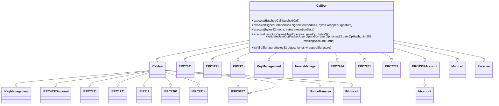
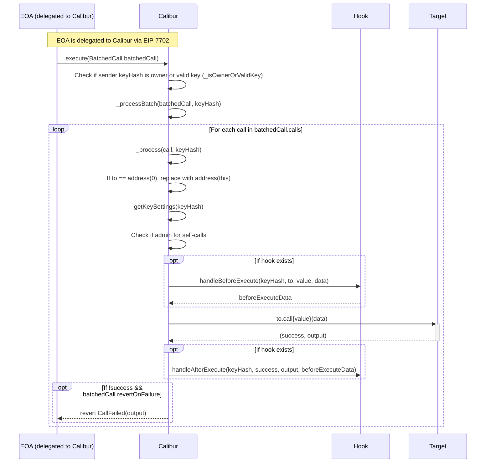
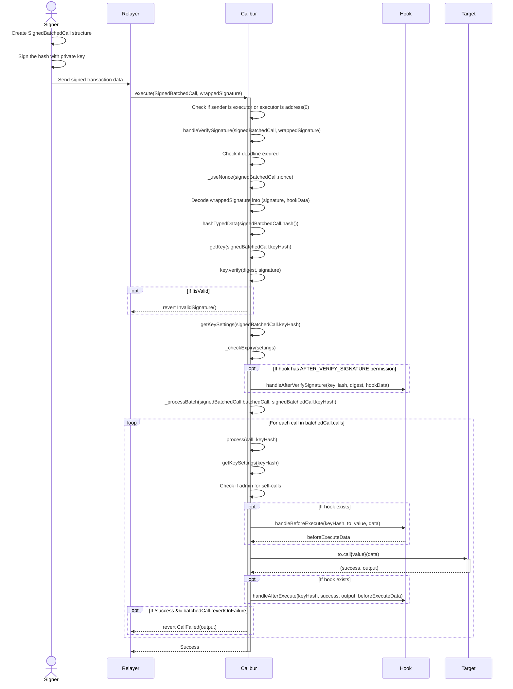
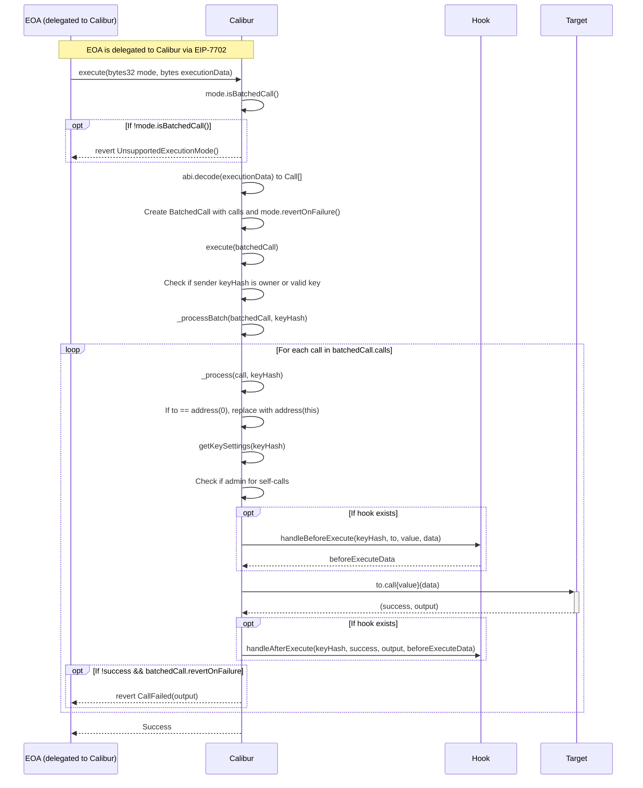
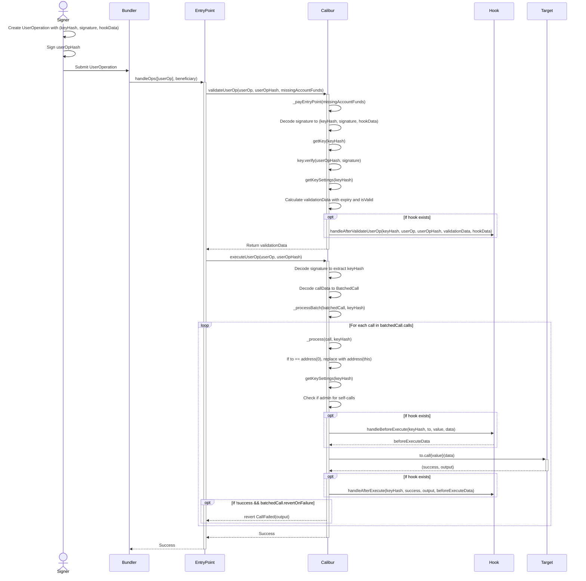
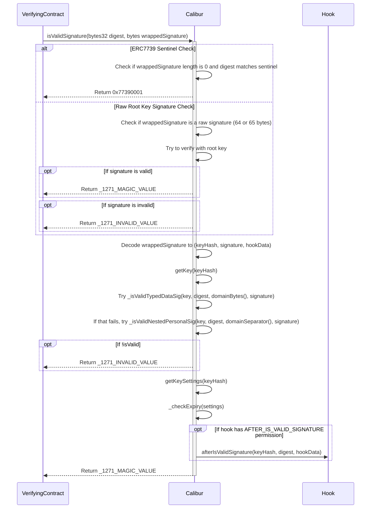
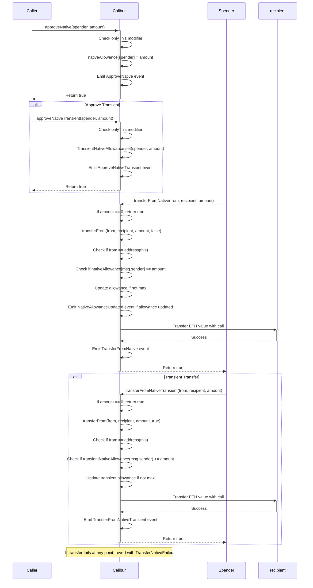

## Architecture
Generated diagrams for the architecture of the Calibur contract.

## Inheritance Diagram

## Sequence Diagrams

### Direct execute() Flow

### Signature-based execute() Flow

### ERC7821 execute() Flow

### ERC4337 UserOp Flow

### ERC1271 isValidSignature Flow

### ERC7914 Native ETH Approval Flow

