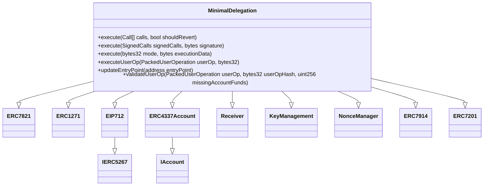

# Minimal Delegation

a minimal, non-upgradeable implementation contract that can be set on an EIP-7702 delegation txn

## Features

- **ERC-4337**: Gas sponsorship and userOp handling through a 4337 interface.
- **ERC-7821**: Generic transaction batching through an ERC-7821 interface.
- **ERC-7201**: Name spaced storage to prevent collisions.
- **Key Management + Authorization** Adding & revoking keys that have access to perform operations as specified by the account owner.

## Architecture
- **Non-Upgradeability**: Upgradability is only allowed through re-delegation rather than a proxy.
- **Singleton:** One canonical contract is delegated to.

## Inheritance Diagram

