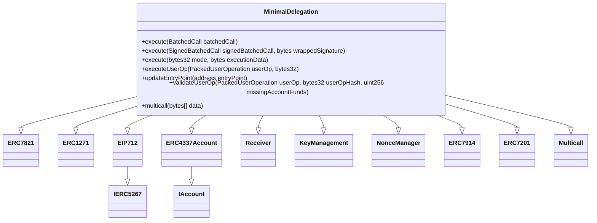
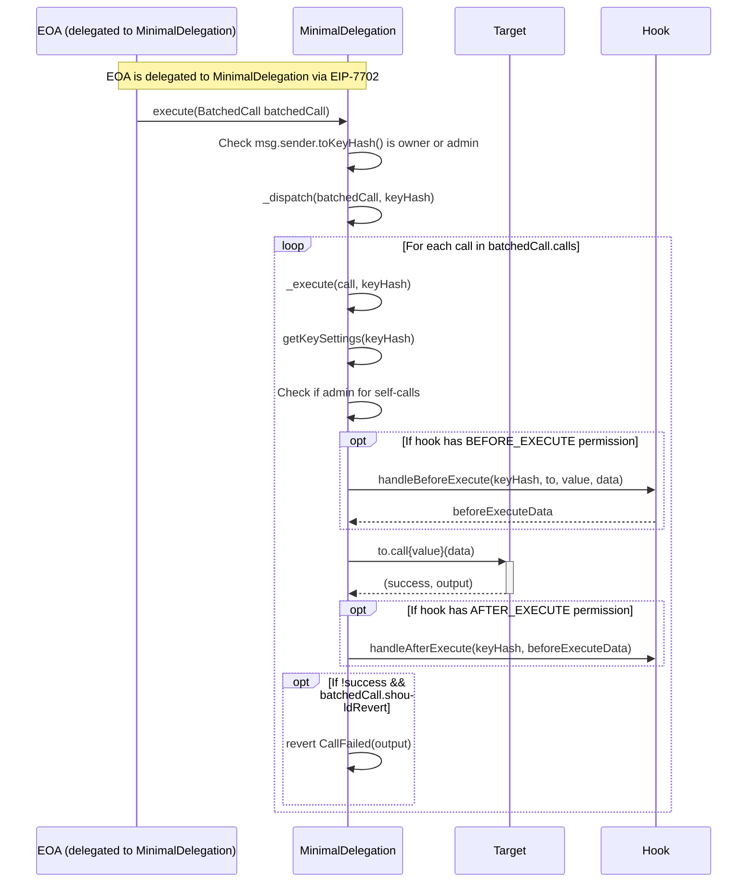
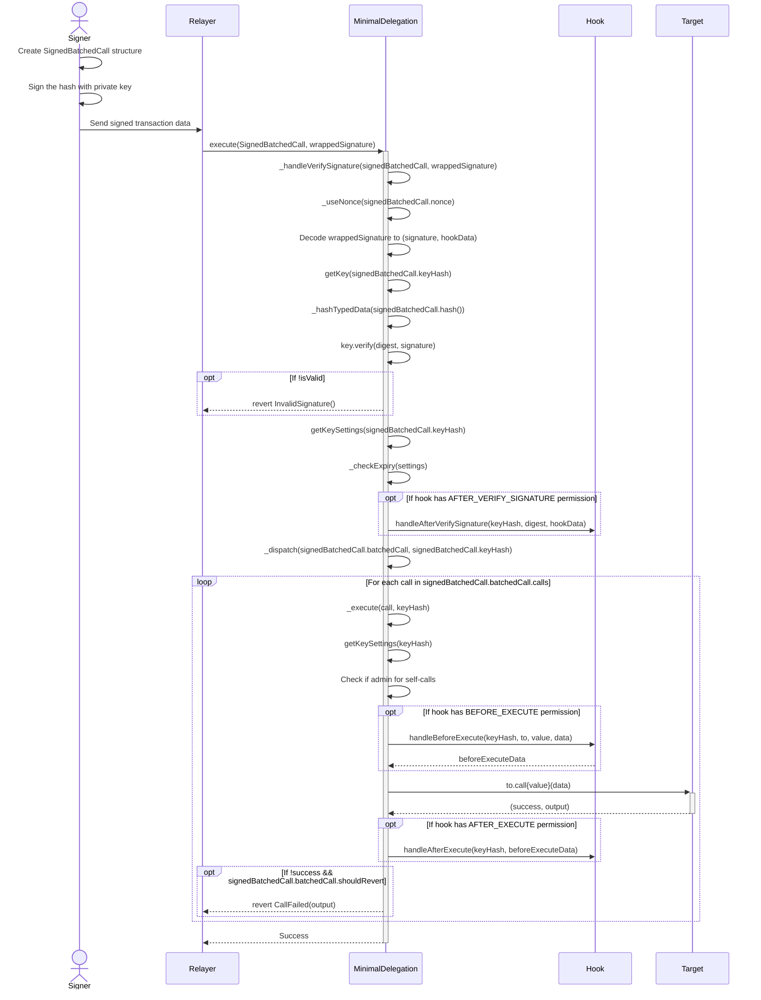
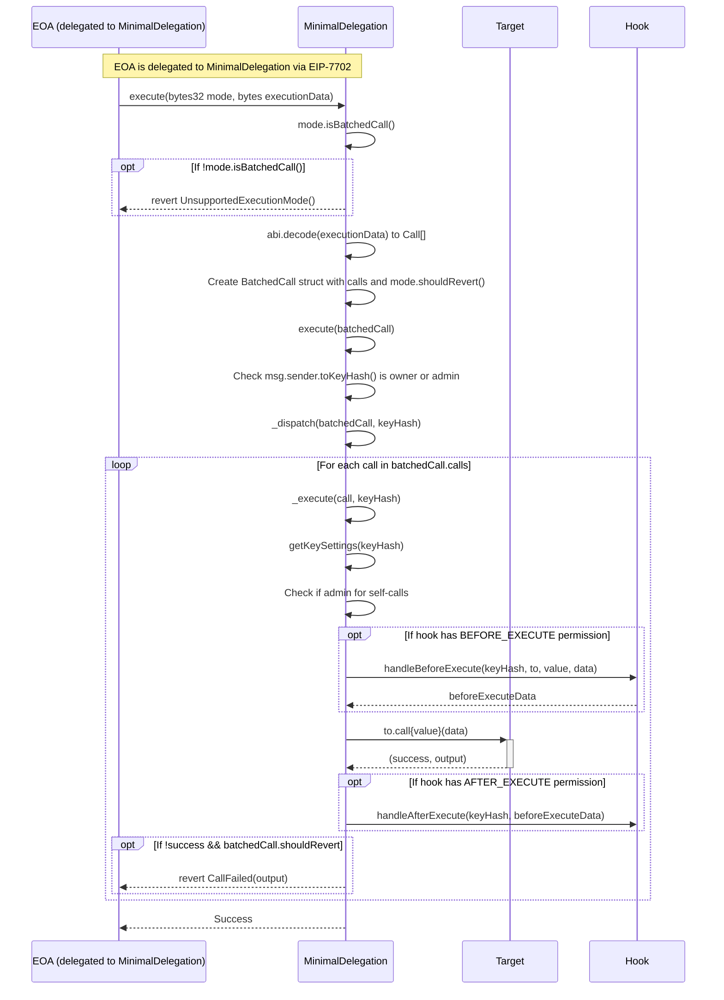
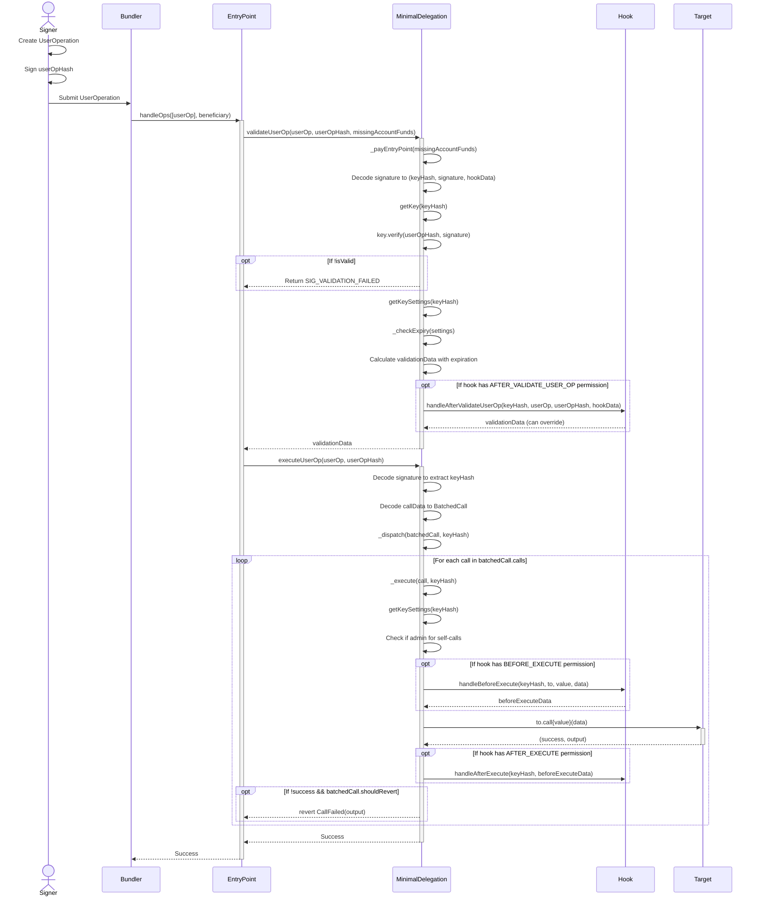
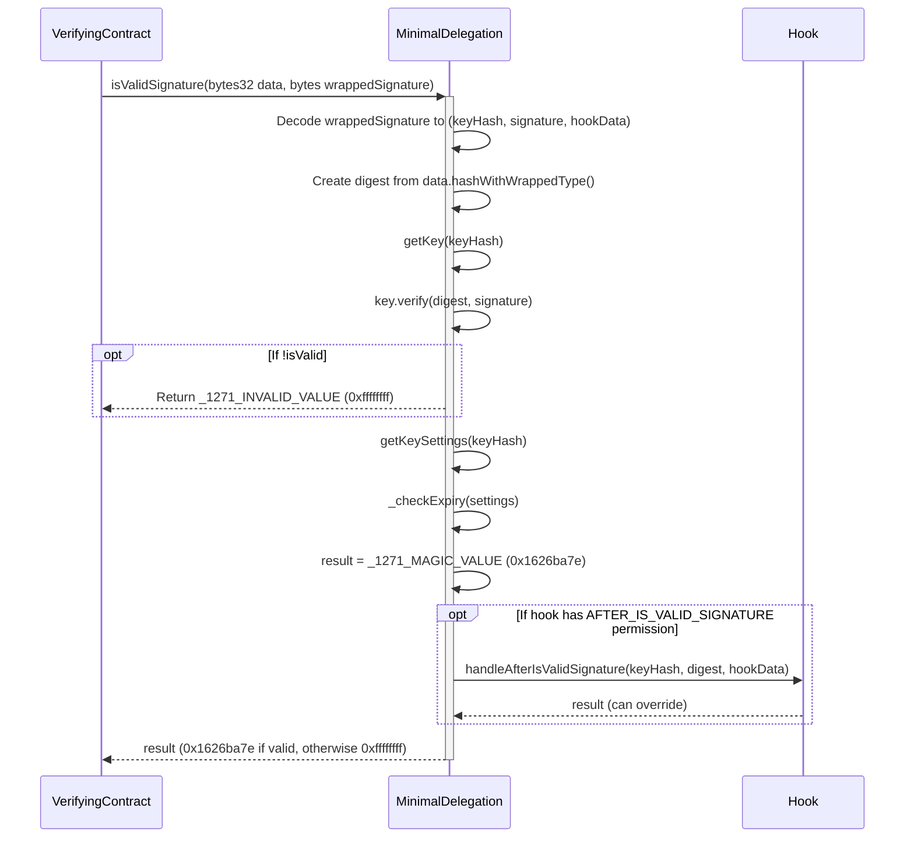

# Minimal Delegation

a minimal, non-upgradeable implementation contract that can be set on an EIP-7702 delegation txn

## Installation
```bash
foundryup --install nightly

cd test/js-scripts && yarn && yarn build

forge test
```

## Features

- **ERC-4337**: Gas sponsorship and userOp handling through a 4337 interface.
- **ERC-7821**: Generic transaction batching through an ERC-7821 interface.
- **ERC-7201**: Name spaced storage to prevent collisions.
- **Key Management + Authorization** Adding & revoking keys that have access to perform operations as specified by the account owner.
- **Multicall**: Execute multiple contract calls in a single transaction.

## Call Data Structures

The contract uses a nested structure approach for managing batched calls:

- **Call**: Basic structure with `to`, `value`, and `data` for a single contract call
- **BatchedCall**: Contains an array of `Call` structures and a `shouldRevert` flag to control error handling
- **SignedBatchedCall**: Adds authentication and nonce management with `batchedCall`, `nonce`, and `keyHash` fields

This nested structure provides better separation of concerns and more flexible signature verification.

## Migration Guide

If you're upgrading from a previous version of MinimalDelegation, note these breaking changes:

1. **Function Signatures**: 
   - `execute(Call[] calls, bool shouldRevert)` → `execute(BatchedCall memory batchedCall)`
   - `execute(SignedCalls signedCalls, bytes signature)` → `execute(SignedBatchedCall memory signedBatchedCall, bytes wrappedSignature)`

2. **Typed Data Hashing**:
   - Typehashes for EIP-712 signatures have changed due to the nested structure
   - Signatures created for the old structures will not work with the new implementation

3. **Hook Data**:
   - Hook processing has changed from `verifySignature` to `handleAfterVerifySignature`
   - Hook permissions now follow an AFTER_* pattern for most operations

4. **Data Organization**:
   - Access to calls is now through nested fields: `signedBatchedCall.batchedCall.calls`
   - The `shouldRevert` flag has moved to the `BatchedCall` structure

Client applications will need to update their transaction construction and signature generation to align with these changes.


## Architecture
- **Non-Upgradeability**: Upgradability is only allowed through re-delegation rather than a proxy.
- **Singleton:** One canonical contract is delegated to.
- **Hook System:** Extensible hook system for customizing account behavior

## Hook Permissions

The contract uses a permission-based hook system that allows for extending functionality at different execution points:

- **BEFORE_EXECUTE_FLAG**: Called before executing a transaction
- **AFTER_EXECUTE_FLAG**: Called after executing a transaction
- **AFTER_VERIFY_SIGNATURE_FLAG**: Called after verifying a signature
- **AFTER_VALIDATE_USER_OP_FLAG**: Called after validating a UserOperation
- **AFTER_IS_VALID_SIGNATURE_FLAG**: Called after validating an ERC1271 signature

Each hook is associated with a key and only called when the key has the appropriate permissions.

## Inheritance Diagram



## Sequence Diagrams

### Direct execute() Flow



### Signature-based execute() Flow



### ERC7821 execute() Flow



### ERC4337 UserOp Flow



### ERC1271 isValidSignature Flow

