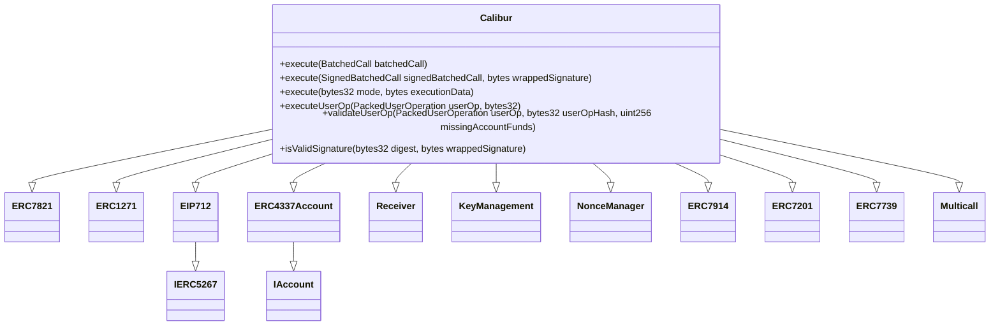
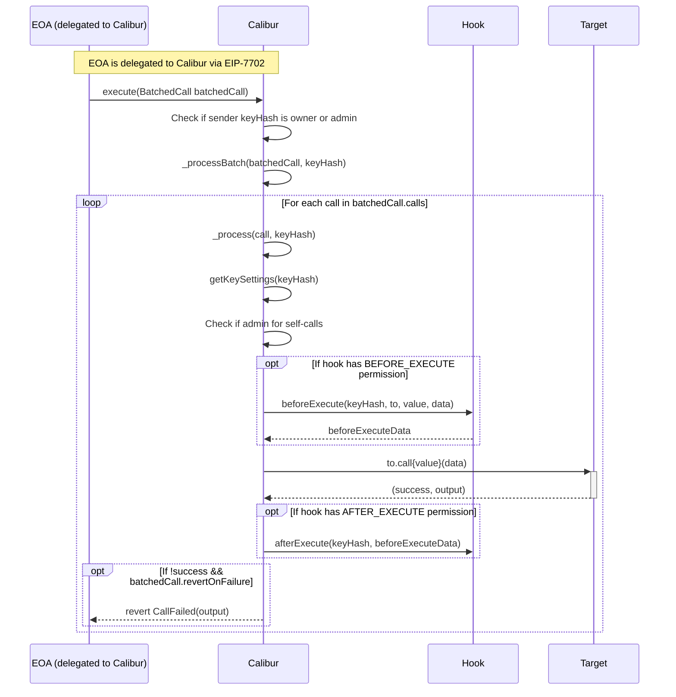
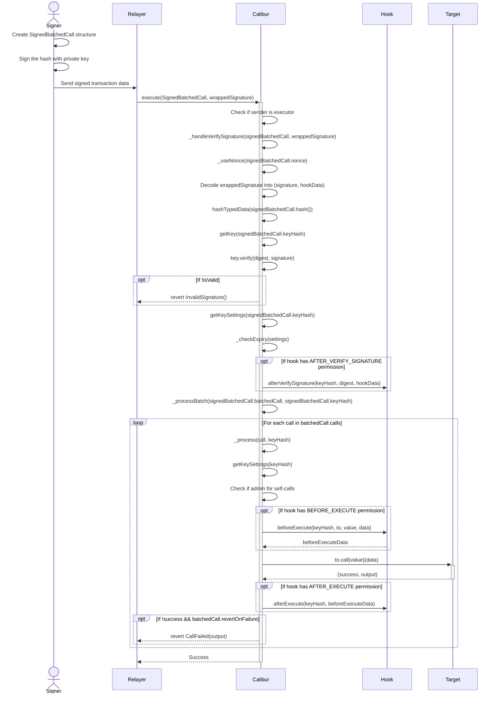
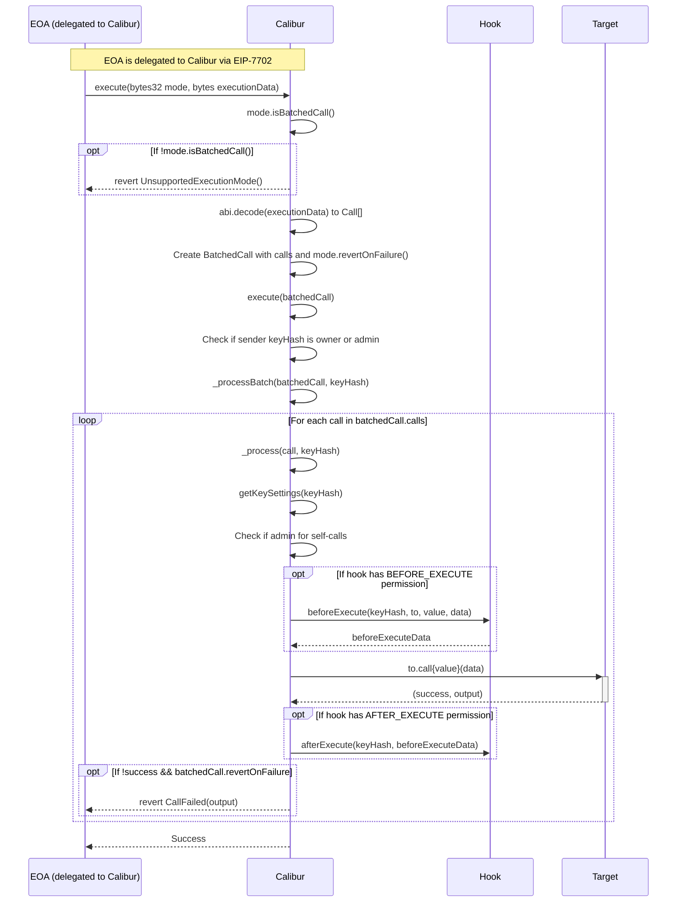
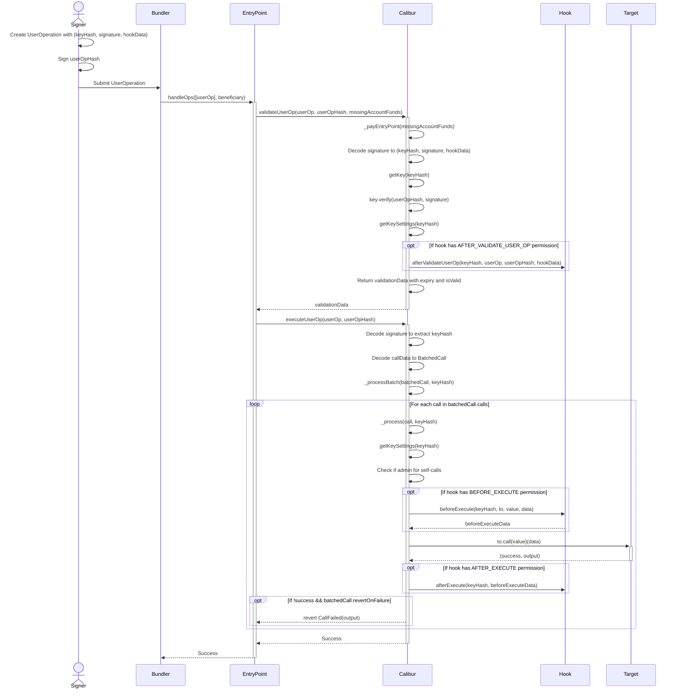
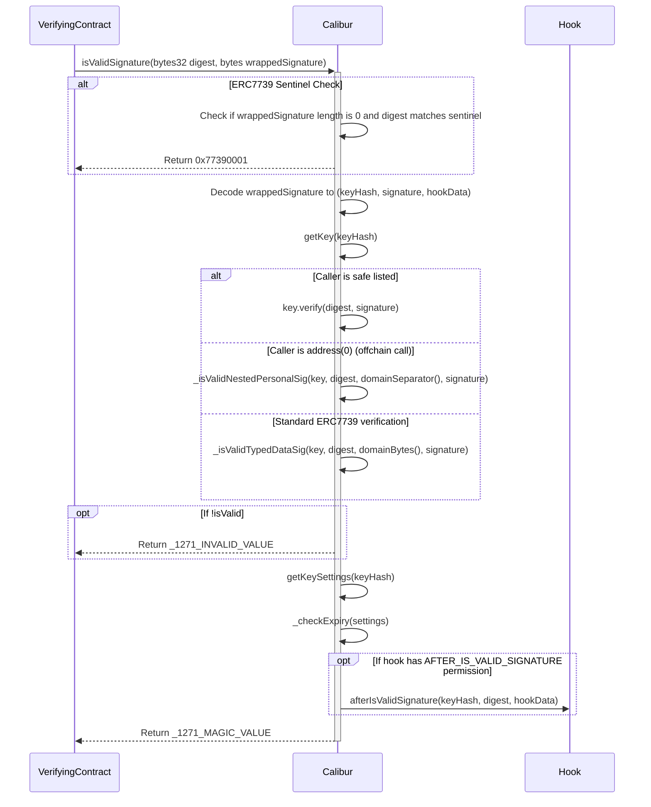
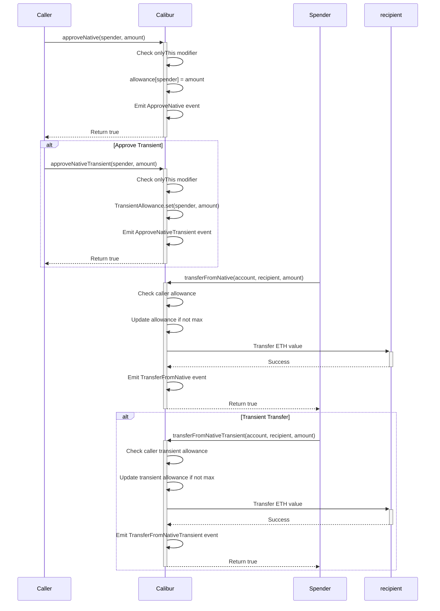

# Calibur

a minimal, non-upgradeable implementation contract that can be set on an EIP-7702 delegation txn

## Installation
```bash
foundryup --install nightly

cd test/js-scripts && yarn && yarn build

forge test
```

## Features

- **ERC-4337**: Gas sponsorship and userOp handling through a 4337 interface.
- **ERC-7821**: Generic transaction batching through an ERC-7821 interface.
- **ERC-7201**: Name spaced storage to prevent collisions.
- **ERC-7739**: Defensive nested typed data hashing for improved security.
- **ERC-7914**: Native ETH approval and transfer functionality.
- **Key Management + Authorization** Adding & revoking keys that have access to perform operations as specified by the account owner.
- **Hooks System**: Extensible validation and execution hooks via bit-patterns.


## Architecture
- **Non-Upgradeability**: Upgradability is only allowed through re-delegation rather than a proxy.
- **Singleton:** One canonical contract is delegated to.

## Inheritance Diagram



## Sequence Diagrams

### Direct execute() Flow



### Signature-based execute() Flow



### ERC7821 execute() Flow



### ERC4337 UserOp Flow



### ERC1271 isValidSignature Flow



### ERC7914 Native ETH Approval Flow

