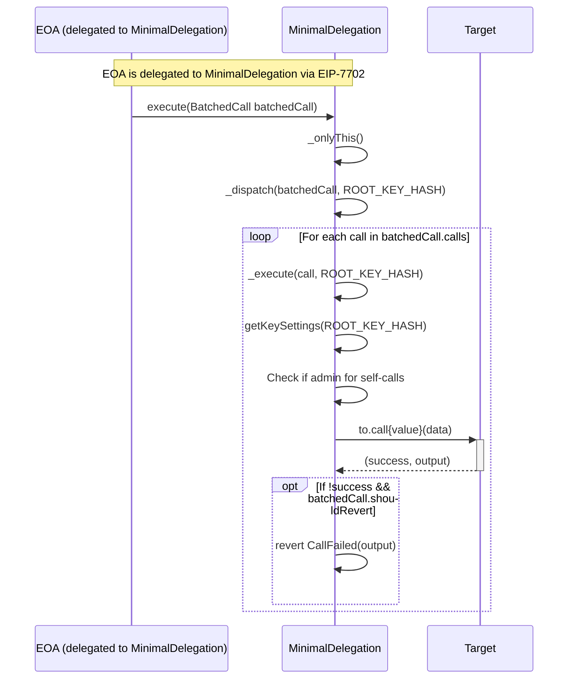
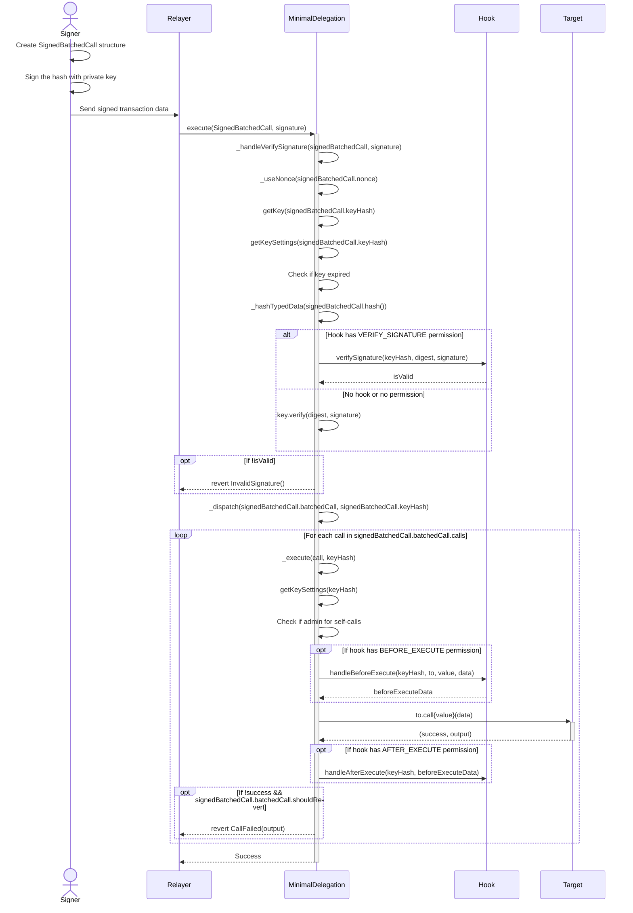
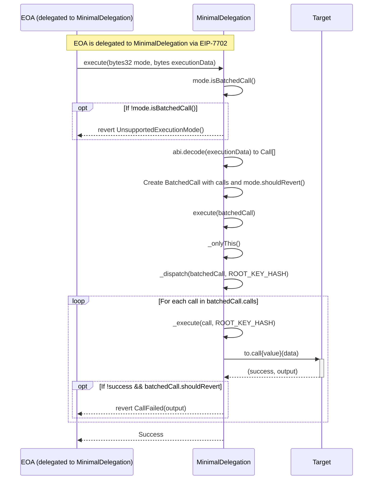
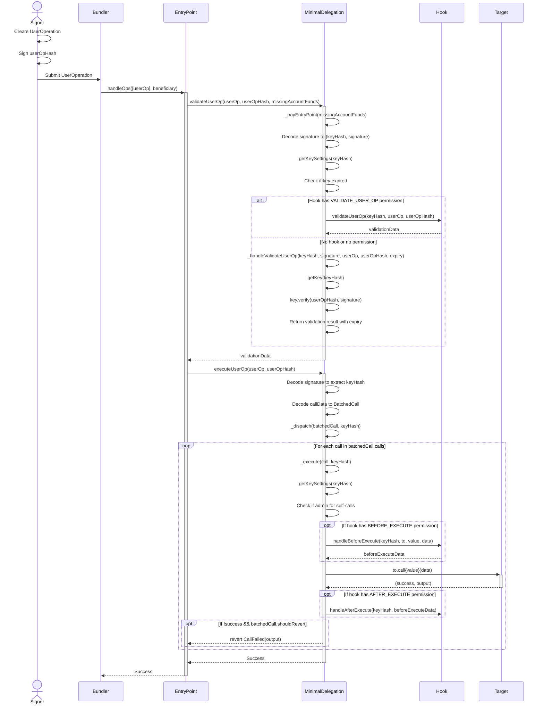
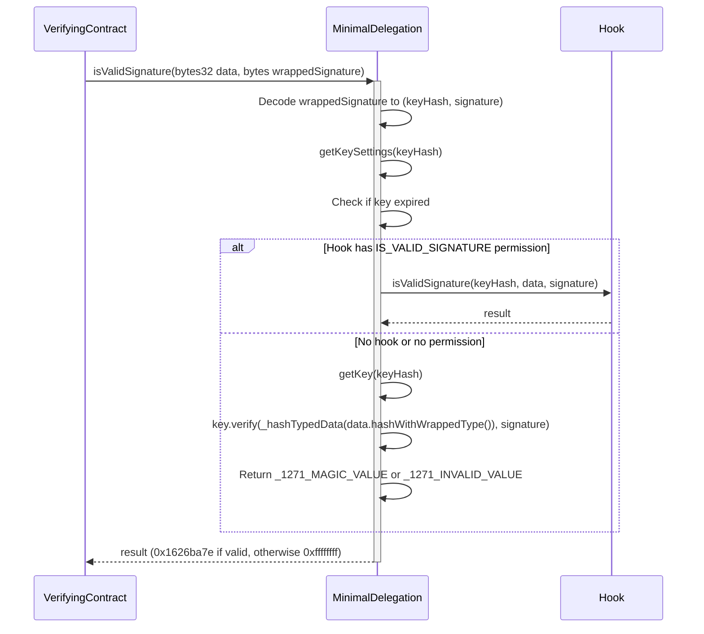

# Minimal Delegation

a minimal, non-upgradeable implementation contract that can be set on an EIP-7702 delegation txn

## Installation
```bash
foundryup --install nightly

cd test/js-scripts && yarn && yarn build

forge test
```

## Features

- **ERC-4337**: Gas sponsorship and userOp handling through a 4337 interface.
- **ERC-7821**: Generic transaction batching through an ERC-7821 interface.
- **ERC-7201**: Name spaced storage to prevent collisions.
- **Key Management + Authorization** Adding & revoking keys that have access to perform operations as specified by the account owner.


## Architecture
- **Non-Upgradeability**: Upgradability is only allowed through re-delegation rather than a proxy.
- **Singleton:** One canonical contract is delegated to.

## Inheritance Diagram


## Sequence Diagrams

### Direct execute() Flow



### Signature-based execute() Flow



### ERC7821 execute() Flow



### ERC4337 UserOp Flow



### ERC1271 isValidSignature Flow



## Migration Notes

### Breaking Changes in v1.x.x

The contract has undergone a structural refactoring to improve modularization and separation of concerns:

1. **Structure Changes**:
   - `SignedCalls` has been replaced with two separate structures:
     - `BatchedCall`: Contains the call array and shouldRevert flag
     - `SignedBatchedCall`: Contains a BatchedCall, nonce, and keyHash

2. **Field Access Changes**:
   - Old: `signedCalls.calls` → New: `signedBatchedCall.batchedCall.calls`
   - Old: `signedCalls.shouldRevert` → New: `signedBatchedCall.batchedCall.shouldRevert`
   - Old: `signedCalls.nonce` → New: `signedBatchedCall.nonce` (unchanged)
   - Old: `signedCalls.keyHash` → New: `signedBatchedCall.keyHash` (unchanged)

3. **Type Hash Changes**:
   - EIP-712 type strings have been updated for the new structure
   - **IMPORTANT**: This changes the digest for signing, which affects offline signature generation

4. **Interface Updates**:
   - Function signatures updated to use the new structures
   - Old: `execute(Call[] calls, bool shouldRevert)` → New: `execute(BatchedCall batchedCall)`
   - Old: `execute(SignedCalls signedCalls, bytes signature)` → New: `execute(SignedBatchedCall signedBatchedCall, bytes signature)`

Integrators should update their code to accommodate these changes, particularly for signature generation and verification.